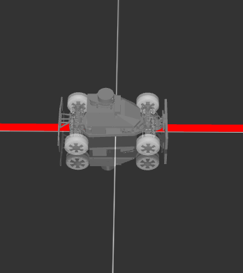

# COM based learning for locomotion.

## Motivation
- The main idea of this project is to create a COM based learning system for locomotion. The input to the learning agent would be observtation like line of sight or line on the ground. The output would be the desired velocity of the robot in COM doamin.

## Description of the envs
There are the two envs in this project.
- [`CarEnv`](##CarEnv)
- [`QuadEnv`](##QuadEnv)

---

## CarEnv
---

### Description
The car as seen here is a simple four-wheeled car. With steering and four wheel drive.

---

### Control
There are two control inputs to the car.
1. `Trottle`: This is the throttle control. The value is between -1 and 1. The value is positive when the car is accelerating. The value is negative when the car is decelerating.
2. `Steering`: This is the steering control. The value is between -1 and 1. The value is negative when the car is steering to the right. The value is postive when the car is steering to the left.
 

---

### Observation
I am using the front camera of the car and color segmentation to observe the red line. As shown in the image below.

 

These images are then converted to a vector of 10 dimensions. Its a binary vector of 1 if the line is present and 0 if the line is absent.

### Reward
The reward is given in three parts.
- Alive reward: binary reward, if the car is on the line or not. $\alpha$
- Linear velocity reward: reward of the com forward velocity of the car. $\beta_x$
- side_vecloty_cost: cost of the side velocity of the car. $\beta_y$.
- Quad_action_cost: cost of the quadratic action of the car. $\sqrt{v_x^2 + v_y^2}$

Final reward is given by:
>$w_1 \cdot \alpha + w_2 \cdot \beta_x - w_3 \cdot \beta_y + w_4 \cdot \sqrt{v_x^2 + v_y^2}$

Here Weight is controlled by the hyperparameter `reward_weights` ($w = [w_1, w_2, w_3, w_4]$):

### Termination condition
1. The car is off the line.
2. The car is moving backward.
   1. If the distance traveled is negative.
   2. IF the distance traveled in recent 10 iteration is less than, the last 10th iteration. ( `mean(distance[-10:]) > distance[-1]` )

https://user-images.githubusercontent.com/34353557/181777815-2f4b3b18-4ab2-40ab-9286-ad6bab660b3d.mp4

### QuadEnv

THe main idea:
$\begin{pmatrix} \dot{X_g} \\ \dot{Y_g} \end{pmatrix} = \begin{bmatrix} \cos(\theta) & -\sin(\theta) \\ \sin(\theta) & \cos(\theta) \end{bmatrix} \cdot \begin{pmatrix} \dot{X_b} \\ \dot{Y_b} \end{pmatrix}$

